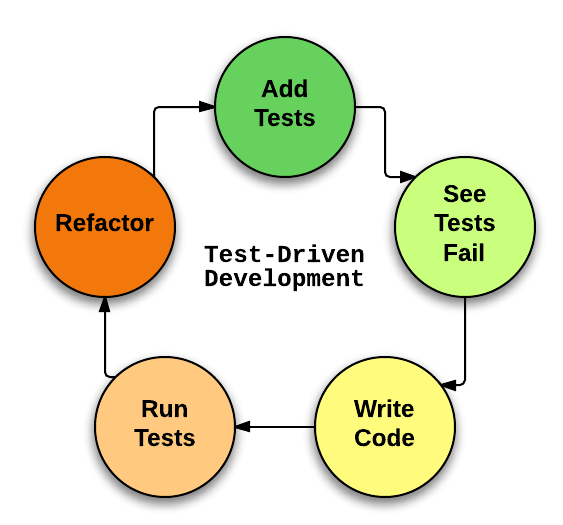
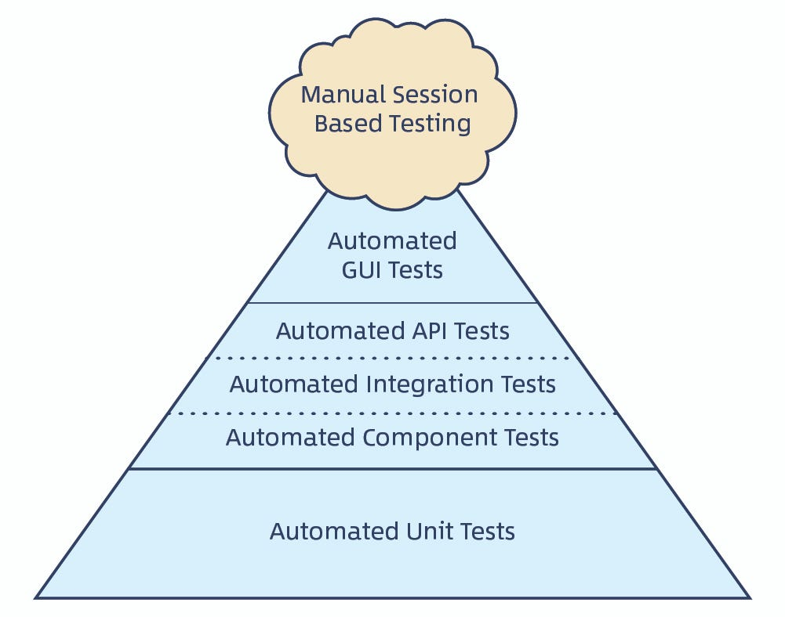

# Calculator with TDD

## Description

* Add 2 numbers
* Substract 2 numbers
* Multiply 2 numbers
* Divide 2 numbers

## What is TDD?

Test Driven Development

* First write tests then actual production code
* Second write non-working test
* Then refactor the code and make it more clean
* This is called: RGR - Red Green Refactor Cycle

## The Piramid of TDD 

